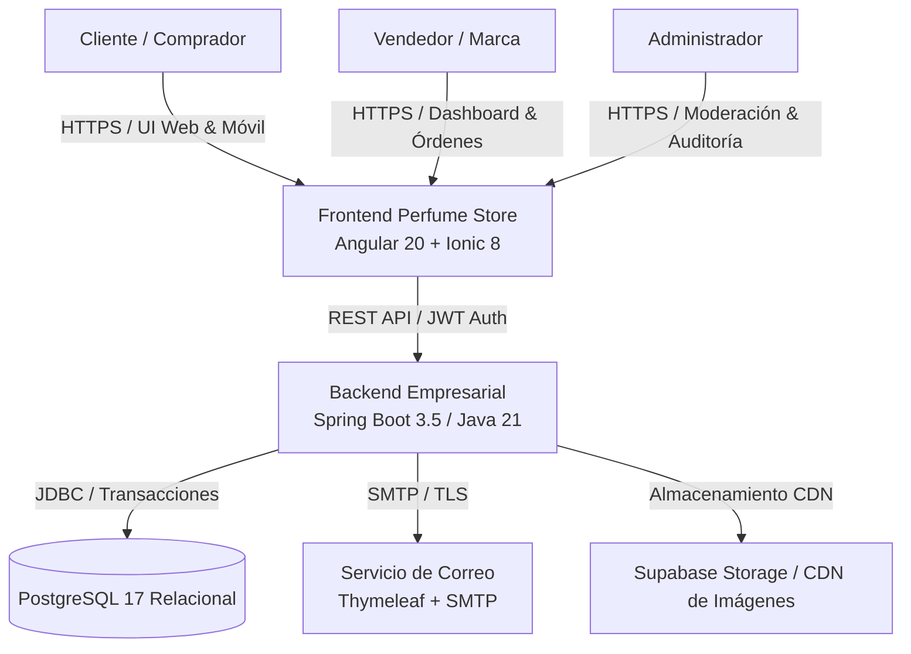
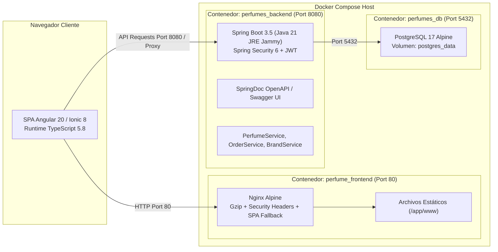
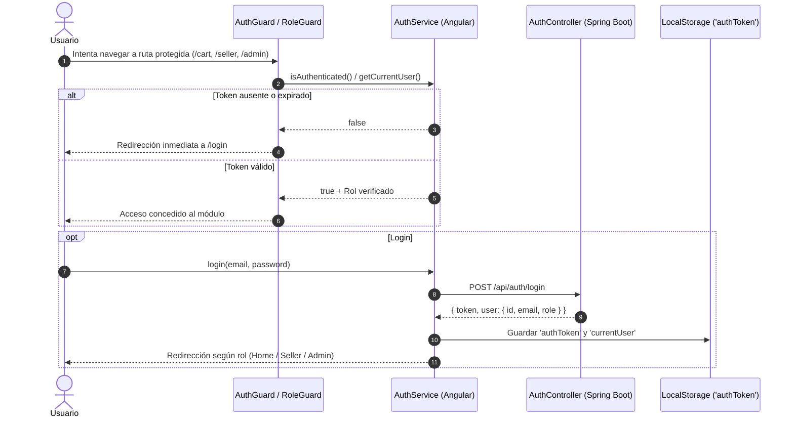
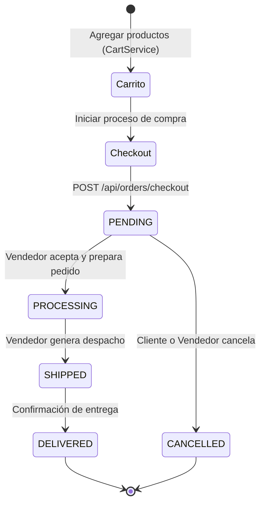

# Arquitectura del Sistema - E-Commerce Luxury Perfumes

> **Proyecto:** Frontend-Perfume & Tienda-de-Perfumes  
> **Estándar:** Google Cloud OKF v0.2 Knowledge Bundle  
> **Patrón Arquitectónico:** SPA Reactiva + API REST Hexagonal / Capas + Contenerización Multi-Stage

---

## 1. Visión General del Sistema (C4 Nivel 1: Contexto)

La plataforma Luxury Perfumes es un ecosistema de comercio electrónico multi-rol enfocado en perfumería fina y fragancias exclusivas.

---

## 2. Diagrama de Contenedores y Redes (C4 Nivel 2)

El despliegue local y de producción se orquesta mediante contenedores Docker conectados a través de una red puente aislada (`perfumes-net`).

---

## 3. Flujo de Autenticación y Route Guards

La seguridad está gobernada por JSON Web Tokens (JWT) con roles de usuario (`CLIENTE`, `VENDEDOR`, `ADMIN`).

---

## 4. Flujo de Compra y Ciclo de Vida del Pedido

---

## 5. Matriz de Componentes del Frontend

| Módulo / Página | Ruta | Guards | Responsabilidad |
|---|---|---|---|
| `HomePage` | `/home` | `AuthGuard` | Catálogo de perfumes con skeleton screens, filtros por nota y precio |
| `ProductDetailPage` | `/product-detail/:id` | `AuthGuard` | Ficha técnica, selector de volumen (ml), favoritos y añadir al carrito |
| `CartPage` | `/cart` | `AuthGuard` | Resumen de productos, cálculo reactivo de subtotales y cupón |
| `CheckoutPage` | `/checkout` | `AuthGuard` | Selección de dirección, pasarela simulada y emisión de orden |
| `SellerPage` | `/seller` | `AuthGuard`, `RoleGuard ('VENDEDOR')` | Dashboard de vendedor: gestión de perfumes, marcas, categorías y **pedidos** |
| `AdminPage` | `/admin` | `AuthGuard`, `RoleGuard ('ADMIN')` | Métricas generales, gestión de usuarios, tiendas y **moderación de fragancias** |
| `NotFoundPage` | `**` | Ninguno | Pantalla 404 personalizada con paleta Luxury Gold |

---

## 6. Principios de Diseño y Calidad
1. **Paleta Luxury Gold**: Negro Obsidiana (`#121212`), Oro Imperial (`#D4AF37`), Oro Oscuro (`#B8860B`) y Blanco Nieve (`#FFFFFF`).
2. **Skeleton Screens**: Feedback visual instantáneo durante operaciones asíncronas para mejorar el First Contentful Paint (FCP).
3. **Resiliencia ante Fallos**: Interceptor global de errores (`GlobalErrorInterceptor`) para captura controlada de errores 401, 403 y 500.
4. **Contenerización Reproducible**: Multi-stage builds con cero secretos en imagen y configuraciones auditadas.
